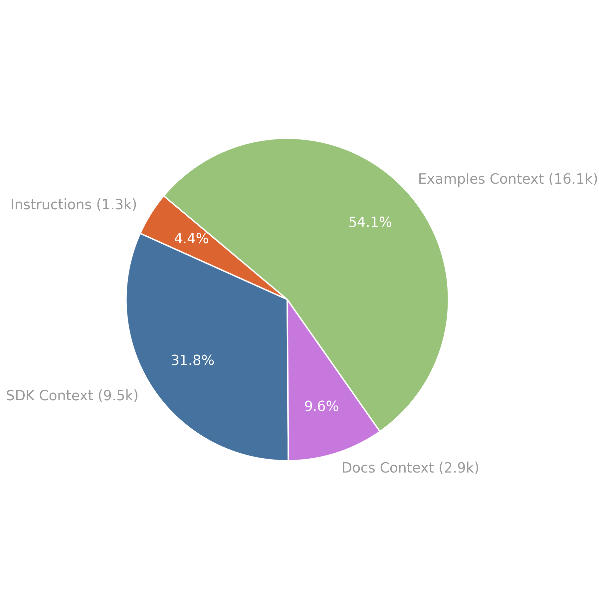

<!-- PROJECT LOGO -->
<br />
<p align="center">
  <a href="https://videodb.io/">
    
  </a>

  <h3 align="center">VideoDB Agent Toolkit</h3>

  <p align="center">
    AI Agent toolkit for VideoDB
    <br />
    <a href="https://videodb.io/llms.txt"><strong>llms.txt »</strong></a> <br/>
    <a href="https://videodb.io/llms-full.txt"><strong>llms-full.txt »</strong></a>
    <br />
  </p>
</p>

# Agent Toolkit for VideoDB

This repository provides tools and context files to help integrate VideoDB into AI applications, LLM-powered agents, and coding tools such as AI Coding IDEs.

## 📦 Components

### 1. llms-full.txt
---

A consolidated reference file that provides:
- Background information on VideoDB
- SDK usage and interface documentation
- Sample usage from VideoDB Docs and Cookbook
- Integration guidance for LLM-based environments

This file is designed to be injected as context into LLMs, AI agents, and smart developer tools to enable better understanding and usage of VideoDB in real time.

[llms-full.txt](https://videodb.io/llms-full.txt) can be found at https://videodb.io/llms-full.txt


### 2. llms.txt
---

A leaner, standards-compliant file designed for use with LLMs at inference time.
It follows the [llms.txt proposal by Answer.AI](https://github.com/answerdotai/llms-txt), which outlines how to provide LLM-readable metadata and API context about a website or tool.

> Use llms.txt for LLM discoverability and llms-full.txt for deep contextual understanding in IDEs and agents.

[llms.txt](https://videodb.io/llms.txt) can be found at https://videodb.io/llms.txt

### 3. MCP (Model Context Protocol)
---

More on MCP usage coming soon.


   


## 🧠 What is a “LLM Context File”?

LLM Context Files are documents designed to optimize how large language models interact with external tools and SDKs. They can be injected at runtime into agents, copilots, or IDE assistants to give them deep knowledge of a product or API.

VideoDB’s Context Files Include:
- Usage instructions and tips
- SDK structure and interface definitions
- Compiled documentation and examples
- Cookbook patterns for solving common use cases

`llms-full.txt` is composed of several core content blocks — here’s how they stack up.


## ⚙️ How is the LLM Context File Generated?

The `llms-full.txt` file is automatically generated from a set of core building blocks, including:

- VideoDB SDK source files  
- Official VideoDB documentation  
- Curated examples from the [VideoDB Cookbook](https://github.com/video-db/videodb-cookbook)  
- Agent-specific usage instructions and patterns

To ensure the context file remains up-to-date and in sync with the evolving SDK and docs, we use a set of GitHub Actions that automatically regenerate and publish `llms-full.txt` whenever any of the source components are updated.

For example:
- Adding a new function to the SDK triggers an update to the SDK section  
- Updating a cookbook example refreshes the relevant usage context  
- Changes to docs are recompiled into the Docs Context block

This automation ensures that LLMs and AI tools always receive the most accurate and complete information — without requiring manual intervention.

## 🤖 Github Actions to Update Context 

### 🧩 Update SDK Context
---

[View Workflow File »](https://github.com/video-db/agent-toolkit/blob/main/.github/workflows/update_sdk_context.yml)

This workflow automates the process of building and updating the SDK documentation. It pulls the latest changes from the SDK repository, generates documentation using Sphinx, and then commits and pushes the updated content to a branch for review.

#### Trigger:  
- **Manual:** Triggered via `workflow_dispatch`.
- **Event-based:** Triggered by a `repository_dispatch` event of type `sdk-context-update`.

#### Workflow:  
- **Clone & Build:** The workflow clones the SDK repository, sets up a Python environment, and builds the documentation using Sphinx.
- **Commit:** It pulls the latest changes from the main branch, commits the generated documentation to a new branch, and pushes the branch.
- **Pull Request:** Finally, a pull request is created to merge the updated documentation into the main branch.

#### Configuration:     

`Config path: config.yaml/sdk_context`
  - `clone_url`: The URL of the SDK repository to clone (e.g., `https://github.com/video-db/videodb-python`).
  - `clone_dir`: The local directory where the SDK repository will be cloned (e.g., `context/sdk/source`).
  - `sphinx_config_dir`: The directory containing the Sphinx configuration (e.g., `context/sdk/sphinx_config`).
  - `output_dir`: The directory where Sphinx generates the documentation output (e.g., `context/sdk/context`).
  - `commit_message`: The commit message used when committing the generated Sphinx Markdown output.
  - `branch_name`:  The branch name to which the changes are pushed (e.g., `sdk-context-branch`).


### 🧩 Update Docs Context
---

[View Workflow File »](https://github.com/video-db/agent-toolkit/blob/main/.github/workflows/update_docs_context.yml)

This workflow automates the update of the documentation context by scraping and processing the documentation site. It generates a hierarchical JSON (doc tree) of the documentation pages, filters and processes the content through an LLM using custom prompts, and consolidates the refined content into a single Markdown output file.

#### Trigger:  
- **Manual:** Triggered via `workflow_dispatch`.

### Workflow:  
- **Scrape:** The workflow scrapes the [documentation site](https://docs.videodb.io) to generate a doc tree JSON.
- **Filtering:** The workflow uses the `include` and `exclude` patterns from the configuration to determine which documents should be processed  only the relevant documentation is selected.(it uses doc tree JSON to see hierarchical strucutue)
- **Crawling:** Each selected document is then crawled using [FireCrawl](https://www.firecrawl.dev/) to retrieve its content. The crawler converts the fetched content into a Markdown format.
- **LLM Processing:**  The Markdown output of each document is processed through an LLM for summarization and refinement. The prompt used by the LLM is configurable through the prompts settings in the configuration file using `prompts` key, allowing for customized processing of each document.

- **Consolidation:**  All LLM-processed Markdown outputs are consolidated into a single file and saved as the final documentation context output.
- **Commit:** Finally, it commits and pushes the changes (or opens a pull request) to update the docs context in the repository.

#### Configuration:    
  
`Config path: config.yaml/docs_context.doc_tree_scrape_config`
  - `script`: The crawler script (e.g., `context/docs/crawl_coda_tree.py`).
  - `output`: The JSON file path where the scraped doc tree is stored (e.g., `context/docs/doc_tree.json`).
  - `url`, `selector`, `selector_value`: Parameters used to scrape the documentation site (e.g., `https://docs.videodb.io` and corresponding HTML attributes).

`Config Path: config.yaml/docs_context`
  - `include` & `exclude`: A list of glob-like patterns that determine which  pages from the scraped documentation tree should be included & excluded in the final output.   

    > *Example: This config will include all pages & subpages under [Welcome to Videodb Docs](https://docs.videodb.io/), [Quick Start Guide](https://docs.videodb.io/quick-start-guide-38), [Visual Search and Indexing](https://docs.videodb.io/visual-search-and-indexing-80) except [Quickstart Guide/Collections](https://docs.videodb.io/collections-68)*

    ```yaml
    include:
      - "Welcome to Videodb Docs"
      - "Quick Start Guide/*"
      - "Visual Search and Indexing/*"
    exclude:
      - "Quick Start Guide/Collections"

    ```
  - `prompts`: This section has config for how the content should be refined using an LLM during the processing phase.
    - `prompt_folder`: The path to folder which has prompt
    - `default_folder`: The file name of the default prompt should be used in llm processing part for the documents 
    - `custom_prompt`: A list with keys `pattern` and `prompt`, which specifies overriding prompt for a file or pattern  
  
    > *Example: This configuration ensures that, while most of the documentation will be processed using the default prompt, any pages under [Quick Start Guide](https://docs.videodb.io/quick-start-guide-38) will be refined using a specialized prompt that may better suit their content and structure*
  
    ```yaml
    prompts:
      prompt_folder: "context/prompts" 
      default_prompt: "default_docs.txt" 
      custom_prompts:
        - pattern: "Quick Start Guide/*" .
          prompt: "custom_quickstart.txt"
    ```

  -  `base_url`: The base URL for the documentation site. This is used to resolve any relative links that are found during scraping.
  - `tree_file`: Specifies the location of the JSON file that stores the scraped documentation tree. This file is generated by the crawler and later used to filter and process the content.
  - `output_file`: The path where the consolidated Markdown output for the docs context will be written. This file will contain the final, merged documentation content.
  - `script_path`: The path to the processing script that converts the scraped doc tree (and other docs data) into a consolidated Markdown file
  - `branch_name` : The name of the branch that will be used when committing and pushing the updated docs context. This allows the update to be reviewed via a pull request before merging.
  - `commit_message`: The commit message used when updating the docs context. This message describes the changes made by the workflow.

### 🧩 Update Examples Context
---

[View Workflow File »](https://github.com/video-db/agent-toolkit/blob/main/.github/workflows/update_examples_context.yml)

This section describes the Update Examples Context workflow. It is responsible for processing example notebooks (IPYNB files) from a specified repository, applying customizable LLM-based summarization to each notebook, and merging the processed outputs into a consolidated Markdown file.


#### Trigger:

- **Manual Trigger:** : The workflow can be initiated manually via `workflow_dispatch` in the GitHub Actions UI.

- **Event-Based Trigger:** It can also be triggered by a `repository_dispatch` event with the type `examples-context-update`.

#### Workflow:

- **Clone & Setup:**  
  - The workflow clones the repository specified by the `clone_url` in the configuration.
  - It sets up the Python environment by creating a virtual environment and installing dependencies.

- **Process IPYNB Notebooks:**  
  - Using the glob patterns defined in the configuration (`include` and `exclude`), the workflow selects the relevant IPYNB files from the cloned repository.
   - Each selected notebook is converted to Markdown.
   - The Markdown output for each notebook is then processed through an LLM for summarization and refinement.  
     The LLM processing uses a default prompt unless a custom prompt is specified for a notebook via custom prompt mappings.

- **Consolidation:**  
  - All LLM-processed Markdown outputs from the notebooks are merged into a single consolidated Markdown file.

- **Commit & PR:**  
  - The consolidated Markdown file is then committed to a new branch (as defined in the configuration).
  - A pull request is created (or updated) to merge these changes into the main branch.


#### Configuration

`Config path: config.yaml/examples_context`

- `include` & `exclude`:
  A list of glob-like patterns that determine which IPYNB notebooks should be included & excluded for processing.  
  *Example: This config will include all notebooks under [quickstart](https://github.com/video-db/videodb-cookbook/tree/main/quickstart) and [guides](https://github.com/video-db/videodb-cookbook/tree/main/guides) except [guides/VideoDB_Search_and_Evaluation](https://github.com/video-db/videodb-cookbook/blob/main/guides/VideoDB_Search_and_Evaluation.ipynb)
  ```yaml
  include:
    - "quickstart/*"
    - "guides/*.ipynb" 
  exclude:
    - "guides/VideoDB_Search_and_Evaluation.ipynb"
  ```

- `prompts`: This section has config for how the content should be refined using an LLM during the processing phase.
  - `prompt_folder`: The path to folder which has prompt
  - `default_folder`: The file name of the default prompt should be used in llm processing part for the documents 
  - `custom_prompt`: A list with keys `pattern` and `prompt`, which specifies overriding prompt for a file or pattern  
  

  > *Example: This configuration ensures that, while most of the ipynbs will be processed using the default prompt, but Multimodal Quickstart will be refined using a specialized prompt that may better suit its content and structure*

  ```yaml
  prompt_folder: "context/prompts"
  default_prompt: "default_ipynb.txt"
  custom_prompts:
    - pattern: "quickstart/Multimodal_Quickstart.ipynb"
      prompt: "custom_2.txt"
  ```

- `clone_url`  
  The URL of the repository containing the example notebooks.  
  > *Example:* https://github.com/video-db/videodb-cookbook

- `clone_dir`  
  The local directory where the repository will be cloned.  
  > *Example: context/examples/source*

- `script_path` 
  The path to the processing script that converts and consolidates the notebooks into Markdown.  
  > *Example: context/examples/process_examples.py*

- `output_file`  
  The file path where the consolidated Markdown output will be written.  
  > *Example: context/examples/examples_context.md*

- `branch_name` 
  The branch name to which the processed output is committed.  

- `commit_message` 
  The commit message used when updating the examples context.  


## 🤖 Misc Github Actions

### 🧩 Update Master Context

[View Workflow File »](https://github.com/video-db/agent-toolkit/blob/main/.github/workflows/update_master_context.yml)


This workflow automates the consolidation of documentation outputs from multiple sources (SDK context, Docs context, and Examples context) into two distinct master files. 
- **llms-full.txt** (and its Markdown variant, **llms-full.md**) 
- **llms.txt** (and its Markdown variant, **llms.md**)

Additionally, the workflow updates token statistics and creates a new minor version tag based on the consolidated output.


#### Trigger:

- **Automatic Trigger:** Automatically triggered on push events that affect Markdown files.

- **Manual Trigger:** Manually via `workflow_dispatch` in the GitHub Actions UI.

#### Workflow

- **Merge Full Documentation:**   
The workflow runs the merge script defined in `llms_full_txt_file.merge_script_path` to combine complete outputs from the Instructions, SDK Context, Docs Context, and Examples Context. The resulting files (**llms-full.txt** and **llms-full.md**) represent the full, consolidated documentation.

- **Token Counting:**   
The workflow executes the token counting script (using tiktoken) to calculate the number of tokens in the master files and updates the README accordingly.

- **Commit Changes:**   
The workflow commits the updated master files (both full and fragment-based) to a new branch using the specified commit message.

- **Create New Tag:**   
A new minor version tag is created by incrementing the current tag’s minor version, aiding version tracking and release management.

- **Pull Request Creation:**   
Finally, a pull request is automatically created (or updated) to merge the changes into the main branch.

#### Configuration:

The workflow uses settings from multiple sections in `config.yaml`:

**For the Full Documentation Merge (llms-full.txt / llms-full.md)**
**Config path:** `config.yaml/llms_full_txt_file`

- `merge_script_path`:  
  The path to the script that merges complete documentation outputs.  
  >*Example:* "context/merge_llms_full_txt.py"

- `input_files`:  
  A list of source files with their names and paths:
  - Instructions 
  - SDK Context 
  - Docs Context 
  - Examples Context 

  > Example: it takes all sub components and merge them
  ```yaml
  input_files:
    - name: Instructions
      file_path: "context/instructions/prompt.md"
    - name: SDK Context
      file_path: "context/sdk/context/index.md"
    - name: Docs Context
      file_path: "context/docs/docs_context.md"
    - name: Examples Context
      file_path: "context/examples/examples_context.md"
  ```

- `output_files`:  
  The final output file paths:
  - **llms_full_txt:** e.g., "context/llms-full.txt"
  - **llms_full_md:** e.g., "context/llms-full.md"

- `layout`:  
  A template defining how the input files are merged, using placeholders like `{{FILE1}}`, `{{FILE2}}`, etc.

**Token Count Settings**

`Config path: config.yaml/token_count`

- `script_path`: The path to the token count script (e.g., "context/count_tokens.py")
- `tiktoken_encoding_model`: Specifies the model encoding (e.g., "gpt-4")
- `token_breakdown_file`, `readme_shields_file`: Additional files for reporting (if applicable)


### 💡 Why Use This Toolkit?
---
- 🔍 Improve VideoDB Code suggestions in AI coding environments
- 🧠 Give agents real-time awareness of VideoDB’s capabilities
- 📚 Provide LLMs with instant access to relevant SDK context
- 🚀 Enable smooth integration of VideoDB into any AI-powered application


### 📌 Coming Soon
---
- Expanded MCP examples and plugin support
- Integration templates for VSCode, Cursor, Continue.dev
- Recipes for deploying VideoDB with LangChain, LlamaIndex, and more