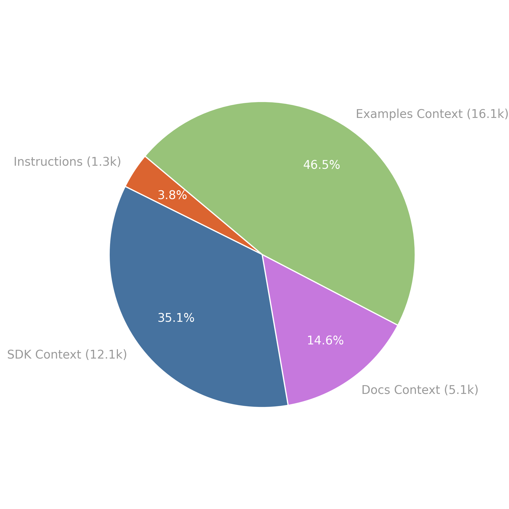

<!-- PROJECT LOGO -->
 

  

  <h3 align="center">VideoDB Agent Toolkit</h3>

  

    AI Agent toolkit for VideoDB
     
    <a href="https://videodb.io/llms.txt"><strong>llms.txt »</strong></a>  
    <a href="https://videodb.io/llms-full.txt"><strong>llms-full.txt »</strong></a>
     
  

# Agent Toolkit for VideoDB

This repository provides tools and context files to help integrate VideoDB into AI applications, LLM-powered agents, and coding tools such as AI Coding IDEs.

## 📦 Components

### 1. llms-full.txt
---

A consolidated reference file that provides:
- Background information on VideoDB
- SDK usage and interface documentation
- Sample usage from VideoDB Docs and Cookbook
- Integration guidance for LLM-based environments

This file is designed to be injected as context into LLMs, AI agents, and smart developer tools to enable better understanding and usage of VideoDB in real time.

[llms-full.txt](https://videodb.io/llms-full.txt) can be found at https://videodb.io/llms-full.txt

### 2. llms.txt
---

A leaner, standards-compliant file designed for use with LLMs at inference time.
It follows the [llms.txt proposal by Answer.AI](https://github.com/answerdotai/llms-txt), which outlines how to provide LLM-readable metadata and API context about a website or tool.

> Use llms.txt for LLM discoverability and llms-full.txt for deep contextual understanding in IDEs and agents.

[llms.txt](https://videodb.io/llms.txt) can be found at https://videodb.io/llms.txt

### 3. MCP (Model Context Protocol)
---

More on MCP usage coming soon.

## 🧠 What is a “LLM Context File”?

LLM Context Files are documents designed to optimize how large language models interact with external tools and SDKs. They can be injected at runtime into agents, copilots, or IDE assistants to give them deep knowledge of a product or API.

VideoDB’s Context Files Include:
- Usage instructions and tips
- SDK structure and interface definitions
- Compiled documentation and examples
- Cookbook patterns for solving common use cases

`llms-full.txt` is composed of several core content blocks — here’s how they stack up.

### 💡 Why Use This Toolkit?
---
- 🔍 Improve VideoDB Code suggestions in AI coding environments
- 🧠 Give agents real-time awareness of VideoDB’s capabilities
- 📚 Provide LLMs with instant access to relevant SDK context
- 🚀 Enable smooth integration of VideoDB into any AI-powered application

### 📌 Coming Soon
---
- Expanded MCP examples and plugin support
- Integration templates for VSCode, Cursor, Continue.dev
- Recipes for deploying VideoDB with LangChain, LlamaIndex, and more